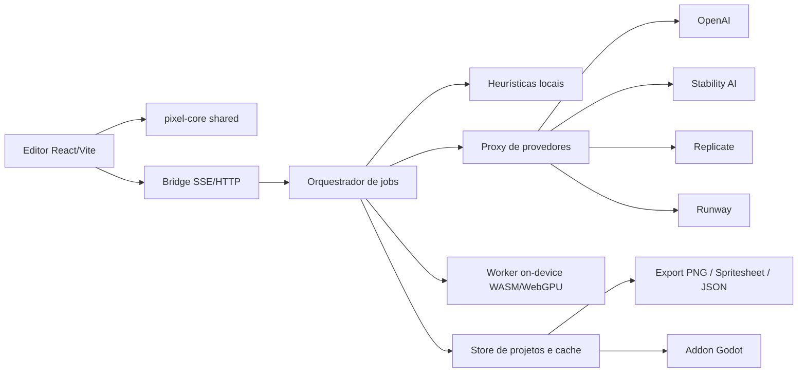
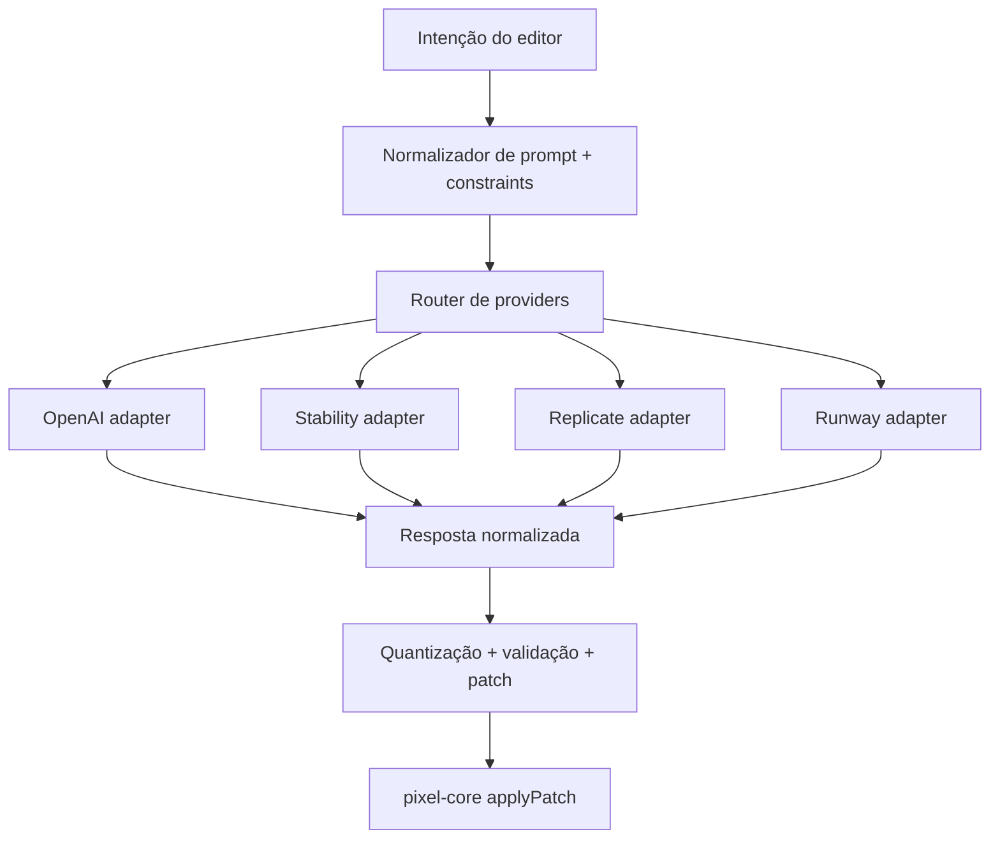

# Facilitar a criação de pixel art com IA no seu editor web

## Resumo executivo

A melhor direção para o seu projeto não é apostar em um único provedor de imagem, e sim em uma arquitetura híbrida com **duas trilhas de geração**: uma trilha **semântica** para ideação e composição, usando APIs generalistas com edição e referências fortes, e uma trilha **pixel-first** para resultados já alinhados à grade, paleta e escala do seu editor. Essa conclusão vem do estado atual do mercado: OpenAI GPT Image favorece edição multi-turno, referências e streaming parcial; Stable Diffusion e ControlNet continuam sendo a base mais controlável e “hackeável” para sketch/structure/img2img; Replicate hoje é o caminho mais flexível para plugar modelos gerais, fine-tunes e modelos pixels específicos; Midjourney continua ótimo para direção de arte, mas ruim como backend programático porque a documentação oficial não oferece API pública geral e proíbe automação por terceiros, salvo exceções raras. citeturn3view0turn15view0turn10search0turn13search13turn39view2

Para o seu stack atual — editor React/Vite, bridge SSE/HTTP, `shared/pixel-core.ts`, canvas 256x256, camadas, frames, timeline, export PNG/spritesheet/JSON e addon Godot — a recomendação mais sólida é: **manter o editor determinístico e local**, mover toda orquestração de IA para um **proxy de servidor** com fila de jobs, e expor ao front apenas chamadas HTTP curtas para criar jobs e um stream SSE para progresso, previews, logs e sugestões de patch. Isso casa bem com o que os provedores realmente oferecem hoje: OpenAI usa REST e suporta streaming por SSE; Replicate oferece REST, SSE e webhooks; Runway trabalha com tarefas assíncronas e polling; Stability AI expõe uma API REST simples para geração, controle e edição. citeturn16search4turn13search1turn13search2turn17search1turn17search0turn6search3

A decisão técnica mais importante para tornar o produto “profissional” é parar de tratar pixel art como apenas uma imagem raster editável e passar a tratá-la como **documento versionado com semântica de animação**. Em outras palavras: o núcleo precisa incorporar, de forma nativa, **tags/animações, slices/9-slice, tilemap metadata, pivôs, hitboxes, export profiles, histórico de patches, diffs binários e contratos claros de import/export para Godot**. Isso aproxima seu produto do que Aseprite e os plugins mais maduros do ecossistema Godot já fazem bem, com a diferença de que você passará a ter um pipeline IA-aware desde o início. citeturn28search8turn28search0turn28search1turn28search3turn27search2turn27search6

A melhor feature set inicial de IA, olhando custo, risco e impacto, é: **inpainting por camada**, **geração guiada por paleta**, **variantes procedurais controladas**, **prompt parametrizado por sprite**, **guided brushes**, **auto-pivot/anchor**, e **batch export para Godot**. Frame interpolation e animation-aware generation valem muito, mas devem entrar depois que o projeto tiver contratos de dados robustos, consistência temporal mínima e QA visual automatizado. citeturn3view2turn22search1turn23search0turn23search1turn31search0turn30search3

No plano econômico, a diferença entre provedores é brutal. Em escala de rascunho, FLUX Schnell no Replicate pode ficar na faixa de milésimos de dólar por imagem, enquanto OpenAI GPT-Image em qualidade média ou alta cresce muito mais rápido; modelos pixel-specific como Retro Diffusion ficam no meio-termo e geralmente entregam um melhor custo/benefício para sprites e assets grid-aligned. Por isso, a recomendação operacional é usar **roteamento por intenção**: generalista para ideação complexa, pixel-specific para asset final, e heurística local para operações baratas como palette transfer, cleanup, alpha trim, auto-outline, onion-skin assist e geração de variantes simples. citeturn14search14turn3view1turn22search2turn23search0turn23search1

## O mercado já resolveu parte do problema

Há quatro famílias de soluções relevantes para o seu caso. A primeira é a de **APIs generalistas fechadas**, como OpenAI e Runway, que entregam excelente aderência a prompt, boa edição com referências e integração relativamente simples. A segunda é a de **ecossistemas abertos e controláveis**, como Stable Diffusion, img2img e ControlNet, que continuam sendo a melhor base quando você quer impor estrutura, sketch, pose, depth ou composição. A terceira é a de **plataformas-router**, como Replicate, que simplificam o acesso a múltiplos modelos e facilitam experimentar checkpoints e fine-tunes niche. A quarta é a de **modelos pixel-specific**, que ainda são menos padronizados, mas já oferecem vantagens concretas como grade mais alinhada, paletas restritas e spritesheets/anim sprites mais coerentes. citeturn10search0turn38view2turn13search14turn22search1turn23search1

A tese central para o seu produto é simples: **modelos generalistas resolvem melhor “o que desenhar”; modelos pixel-specific resolvem melhor “como isso deve ocupar a grade de pixels”**. Isso aparece claramente nas fontes. O ecossistema Stable Diffusion/img2img descreve o uso de uma imagem inicial e um parâmetro `strength` para controlar quanto a saída se afasta da referência; ControlNet foi criado exatamente para adicionar controles espaciais fortes; e os modelos Retro Diffusion foram treinados explicitamente para pixel art “grid aligned”, consistente em estilo e com paleta limitada. Já checkpoints pixel-art de comunidade frequentemente admitem que a saída “não é pixel perfect” sem pós-processamento, o que reforça a importância de um pipeline de quantização e cleanup dentro do editor. citeturn38view0turn38view2turn10search0turn22search1turn21search5

### Comparativo técnico das principais ferramentas e APIs

| Solução | Onde brilha | Onde falha para pixel art | Integração prática | Custo indicativo | Observação crítica |
|---|---|---|---|---|---|
| OpenAI Image API e Responses | edição multi-turno, referências múltiplas, partial images, API limpa | controle espacial fino ainda é menor que um stack ControlNet; latência pode subir bastante em prompts complexos | REST; SSE para streaming parcial; Realtime por WebSocket em outros cenários | GPT-Image-2 em 1024²: ~US$ 0,006 low, ~US$ 0,053 medium, ~US$ 0,211 high | excelente para “ideia → refino” e inpaint por camada |
| Stable Diffusion + img2img + ControlNet | maior controlabilidade, possibilidade local, open weights, sketch/structure | exige mais tuning, GPU e pós-processamento para ficar “pixel-clean” | local, via Stability API, ou via Replicate/self-host | Stability Core ~US$ 0,03/imagem; Ultra ~US$ 0,08/imagem | melhor base para um editor IA profundamente controlável |
| Stability AI API | acesso simples ao ecossistema SD, inpaint/outpaint/control | menos flexível que self-host full stack; docs e pricing mudam mais rápido | REST com `Authorization: Bearer` | credit-based; 1 crédito = US$ 0,01 | boa ponte entre velocidade de entrega e abertura |
| Runway API | referência visual forte, workflows de mídia, tarefas assíncronas bem estruturadas | menos vocacionado para pixel art estrito e grade/paleta do que modelos especializados | REST async + polling; uploads efêmeros | `gen4_image_turbo` ~US$ 0,02/img; `gen4_image` ~US$ 0,05 a US$ 0,08/img | ótimo para concepts, key art e variações de estilo |
| Replicate | unifica modelos oficiais, comunidade e custom; SSE, webhooks, deployments | heterogeneidade de schema e qualidade entre modelos | REST, SSE, webhooks | FLUX Schnell ~US$ 0,003/img; SD 3.5 Turbo ~US$ 0,04/img | melhor laboratório de experimentação e roteamento |
| Midjourney | direção de arte e exploração visual | sem API pública geral e com automação proibida | não serve como backend padrão do editor | assinatura, não API-first | use como referência de art direction, não como infraestrutura |
| Pixel-specific models | grade, paleta, tiling, sprite sheets e estética pixel-native | cobertura desigual, manutenção irregular e poucas garantias de compatibilidade | geralmente via Replicate/Hugging Face/custom hosting | Retro Diffusion Fast ~US$ 0,017/img; Plus ~US$ 0,025/img; Animation ~US$ 0,07/img | melhor candidato para asset final e batching de sprites |

Os valores, capacidades e formatos acima foram reunidos de documentação oficial ou páginas oficiais de produto: OpenAI documenta geração, edição, variações legadas, streaming parcial, custos por qualidade e limites de latência; Stability AI publica preços por crédito e descreve Stable Image Core/Ultra e serviços de controle como Sketch e Structure; Runway publica modelos, preços por crédito e fluxo assíncrono de tarefas; Replicate publica preços/posicionamento dos modelos, SSE, webhooks e modelos oficiais/pixel-specific; Midjourney documenta explicitamente que não fornece API pública geral e proíbe automação por terceiros. citeturn3view0turn3view1turn15view0turn16search0turn41view0turn41view2turn35search0turn24search1turn33search0turn6search3turn12search12turn17search1turn17search0turn13search14turn14search14turn14search9turn22search2turn23search0turn23search1turn39view2

### Leitura prática por ferramenta

**OpenAI** é o melhor candidato para o seu fluxo de “gerar → corrigir → iterar” porque a plataforma suporta tanto um caminho direto de imagem por `POST /v1/images/generations` e `POST /v1/images/edits` quanto um caminho conversacional via `POST /v1/responses`, no qual a imagem gerada entra no contexto e pode ser refinada em turnos sucessivos. Isso é particularmente útil para um editor com camadas, frames e timeline, porque você pode transformar cada operação de IA em um job com histórico reexecutável. O custo, porém, cresce rápido em qualidade média e alta, e a própria documentação alerta que prompts complexos podem levar até dois minutos. citeturn41view2turn42view0turn42view2turn41view0

**Stable Diffusion + img2img + ControlNet** continua sendo a melhor base para um editor pixel art “modulável”. O paper original de ControlNet foi feito para adicionar condicionamento espacial sem destruir o backbone de geração; a documentação de img2img explica claramente como uma imagem inicial e o `strength` controlam a distância da saída; e a release do Stable Diffusion 3.5 enfatiza abertura, customização e execução em hardware de consumo. Isso faz toda a diferença quando você quer transformar uma seleção de camada, um rascunho em pixel, um silhouette pass ou uma pose sheet em um ativo final coerente. citeturn10search0turn38view0turn38view2turn10search1turn26search1

**Replicate** é excepcional para o seu cenário porque ele desacopla a decisão “qual modelo usar” da sua camada de produto. A plataforma documenta modelos oficiais sempre aquecidos, API estável e preços previsíveis nesses modelos, além de SSE para streaming e webhooks assinados. Para um editor que ainda está descobrindo o melhor stack, isso vale mais do que “escolher o provedor certo” cedo demais. Replicate também é, hoje, o caminho mais realista para integrar modelos pixel-specific como Retro Diffusion sem assumir desde já o custo de self-hosting. citeturn13search14turn13search1turn13search2turn40view0turn40view1turn22search1turn23search1

**Runway** é forte quando a necessidade é trabalhar com **referências** e pipelines de mídia mais amplos. A documentação destaca uso de imagens de referência com tags dentro do prompt, uploads efêmeros, tarefas assíncronas e modelos de imagem específicos. Isso é excelente para geração de concepts, moodboards, packaging, UI mockups e variações de estilo, mas menos natural para o “último quilômetro” do pixel art rígido, onde grade, paleta e snapping são críticos. citeturn12search4turn12search10turn17search1turn12search12

**Midjourney** deve ficar fora da arquitetura principal. A documentação oficial é clara: a plataforma não disponibiliza API pública geral, não aceita third-party apps/scripts na maior parte dos casos e proíbe automação de interações. Ela continua útil como benchmark de direção de arte, variações, character/style reference e exploração visual, mas não deve ser o backend do seu editor nem do seu bridge MCP. citeturn10search2turn11search12turn11search13turn39view2

## Arquiteturas que fazem sentido para o seu stack

### O desenho certo para React/Vite, MCP e bridge SSE/HTTP

A sua arquitetura atual já aponta para uma boa separação de responsabilidades: editor web no cliente, bridge para orquestração, `shared/pixel-core.ts` como base semântica e exportadores como fronteira de saída. O que falta é formalizar isso como **arquitetura de jobs**. Nessa arquitetura, o editor nunca “fala com IA”; ele apenas envia um estado, uma seleção, uma máscara, uma paleta e uma intenção. O bridge/proxy decide o fluxo: heurística local, provedor externo, modelo pixel-specific no Replicate ou, no futuro, inferência on-device com WebGPU/WASM. Essa divisão reduz acoplamento, preserva undo/redo, facilita cache de resultados e protege segredos de API. A recomendação é coerente com as práticas oficiais dos provedores: OpenAI recomenda manter credenciais em variáveis de ambiente/secret manager; Runway explícita que a chave nunca deve ser exposta ao cliente; e o fluxo do OpenAI Realtime em browser depende de token efêmero. citeturn29search5turn32view4turn3view4



### Comparativo das arquiteturas possíveis

| Arquitetura | UX | Latência | Custo | Privacidade | Quando usar |
|---|---|---|---|---|---|
| Heurística local pura | instantânea ou quase | muito baixa | quase zero | máxima | palette transfer, cleanup, trim, outline, flood fill sem IA generativa |
| Proxy servidor + provedores externos | boa, previsível, auditável | baixa a média | variável | média | caminho principal em produção |
| Provedor externo direto do browser | simples de prototipar, ruim de endurecer | baixa | variável | fraca | evitar, exceto tokens efêmeros muito controlados |
| On-device WASM/WebGPU | ótima para privacidade e assistentes leves | baixa após warmup | baixo recorrente, alto inicial | máxima | modelos pequenos, classificação, sugestão, auto-tagging e alguns geradores compactos |

Os dados oficiais sustentam esse quadro. OpenAI e Runway reforçam o uso server-side de segredos; EventSource é unidirecional e mantém conexão HTTP persistente; WebSocket é bidirecional; ONNX Runtime Web, Transformers.js e WebLLM mostram que inferência local em navegador já é viável com WebGPU, embora o trade-off continue sendo peso de modelo, compatibilidade de navegador e tempo de warmup/cache. citeturn29search5turn32view4turn19view0turn18search2turn20search0turn20search5turn20search3turn20search6

### Recomendação arquitetural

A recomendação específica para o seu produto é um **modelo híbrido em quatro camadas**.

A primeira camada é a **heurística local**: tudo que puder ser feito sem rede deve sair daí. Entram quantização de paleta, nearest-neighbor downscale, auto-trim, detecção de bounding box, auto-pivot, onion-skin assist, flood merge, outline synthesis, alpha cleanup e normalização de export. Isso melhora muito a sensação de instantaneidade e reduz custo. O editor de pixel art precisa parecer “editor”, não “chat de imagem”. Essa conclusão é uma inferência técnica, mas conversa com a própria diferenciação entre SSE/WebSocket para eventos e inferência local com OffscreenCanvas/WebGPU para tarefas pesadas no cliente. citeturn30search0turn19view0turn18search2turn20search0turn20search5

A segunda camada é a **orquestração proxy**. Ela recebe a intenção do usuário, escolhe o provedor e traduz a resposta em patches determinísticos no projeto. Essa camada também faz rate limiting, guarda cache por hash do prompt/seed/paleta, assina webhooks, rehidrata jobs e registra custo por operação. É aqui que o bridge SSE/HTTP deixa de ser apenas transporte e vira “job bus” do produto. Esse desenho combina com Replicate, que já usa webhooks assinados e SSE, com Runway, que usa tasks assíncronas, e com OpenAI, que oferece streaming parcial por SSE e caminhos de edição nativos. citeturn40view0turn40view1turn13search1turn13search2turn17search1turn24search0

A terceira camada é a de **provedores externos roteados por intenção**. Sugestão prática: OpenAI para refino e inpainting semântico, Stability/ControlNet para sketch/structure/img2img, Replicate para pixel-specific e experimentação, Runway para concepts e reference-heavy workflows. Midjourney fica de fora do pipeline automático. citeturn3view2turn33search0turn22search1turn12search4turn39view2

A quarta camada, opcional no curto prazo, é a **assistência on-device**. Não serve para tudo, mas já serve muito bem para classificação, embeddings, QA, auto-tagging, busca semântica, reranking de variantes e alguns modelos menores no navegador. ONNX Runtime Web e Transformers.js já permitem isso; WebLLM mostra que inferência local pode inclusive expor API estilo OpenAI para componentes do seu app. citeturn20search4turn20search5turn20search3turn20search12

### REST, SSE e WebSocket no seu contexto

Para o seu stack, a regra prática deveria ser: **HTTP para comando**, **SSE para progresso**, **WebSocket apenas quando houver colaboração ou edição bi-direcional contínua**. SSE combina muito bem com geração de imagem porque o cliente só precisa receber eventos de etapa, preview parcial, logs e encerramento. O próprio OpenAI usa streaming por SSE em Responses e Images; Replicate documenta SSE para modelos que suportam streaming. Além disso, EventSource é unidirecional, simples e suficientemente robusto para esse caso. citeturn16search4turn24search0turn13search1turn19view0

Há dois cuidados aqui. O primeiro é operacional: sem HTTP/2, SSE sofre com o limite baixo de conexões por domínio no navegador, então você deve **multiplexar todos os eventos do projeto em um único stream por aba**. O segundo é de autenticação: o construtor nativo de `EventSource` foi pensado em torno de URL e modo de credenciais, então é melhor autenticar esse stream com cookie HttpOnly/sessão no seu bridge, em vez de depender de credenciais de provedores no browser. citeturn19view0

WebSocket só vale a pena quando você realmente precisar do canal bi-direcional com baixa latência contínua: colaboração multiusuário, presença, cursor compartilhado, edição remota ou sessões realtime específicas. A API WebSocket do navegador é bidirecional; OpenAI descreve conexão Realtime por WebSocket, inclusive com token efêmero quando necessário no browser. citeturn18search2turn3view4turn3view5

## Contratos internos, formato de projeto e unificação do pixel-core

### O que deve virar responsabilidade do `shared/pixel-core`

Hoje, pelo stack descrito, `shared/pixel-core.ts` já é o lugar natural para virar o **contrato canônico do documento**. Esse pacote não deve conter apenas helpers; ele deve se tornar a fonte única de verdade para: schema do projeto, tipos de camada/frame/cel, composição determinística, paleta, pivôs, hitboxes, slices, tags de animação, export profiles, patch application, serialização binária, hashing visual, diffs e validação. Em termos práticos, a regra deveria ser: **se o editor, o bridge, o worker e o addon Godot precisam entender algo, isso nasce no pixel-core**. Essa escolha também aproxima o produto do padrão dos editores maduros, nos quais tags, slices, tilemap e export já são partes do documento, não hacks externos. citeturn28search8turn28search0turn28search1turn27search4

### Formato de projeto recomendado

A recomendação é adotar um documento de projeto com **duas camadas de persistência**. A camada semântica fica em JSON versionado; a camada raster fica em blobs binários ou chunks compactados. O JSON deve ser amigável à inspeção, diff e migração de schema; o raster, por outro lado, deve ser otimizado para leitura, composição parcial e histórico. JSON Patch é um padrão IETF adequado para transportar mudanças estruturais finas, mas você não deve usar JSON Patch para “carregar pixels” diretamente; para pixels, use referências a blobs binários versionados. citeturn30search2turn30search6turn30search1

Um esqueleto plausível:

```json
{
  "schemaVersion": "1.0.0",
  "project": {
    "id": "proj_01",
    "name": "hero_slime",
    "canvas": { "width": 256, "height": 256, "pixelAspect": 1 },
    "palette": {
      "id": "pal_db16",
      "colors": ["#140c1c", "#442434", "#30346d"]
    },
    "layers": [
      {
        "id": "layer_body",
        "name": "Body",
        "type": "bitmap",
        "visible": true,
        "opacity": 1,
        "blendMode": "normal"
      }
    ],
    "frames": [
      { "id": "f0", "durationMs": 100 },
      { "id": "f1", "durationMs": 100 }
    ],
    "cels": [
      {
        "layerId": "layer_body",
        "frameId": "f0",
        "bitmapRef": "blob:rle:sha256-abc",
        "offset": { "x": 0, "y": 0 }
      }
    ],
    "tags": [
      { "id": "idle", "from": 0, "to": 3, "direction": "forward", "loop": true }
    ],
    "slices": [
      { "id": "hurtbox", "x": 8, "y": 10, "w": 12, "h": 10 }
    ],
    "pivot": { "mode": "per-tag", "values": { "idle": { "x": 8, "y": 14 } } },
    "exportProfiles": [
      { "id": "godot_spriteframes", "type": "spritesheet+json", "engine": "godot" }
    ],
    "ai": {
      "history": [],
      "references": [],
      "providerHints": {}
    }
  }
}
```

### Patches, histórico e diffs

O melhor desenho para histórico é **event sourcing leve**. Em vez de salvar snapshots completos a cada ação, você persiste uma sequência de operações: `addLayer`, `setPalette`, `applyRasterPatch`, `movePivot`, `setTag`, `mergeSelectionFromAI`, e assim por diante. Mudanças semânticas usam JSON Patch ou um formato equivalente inspirado nele; mudanças raster usam um patch binário próprio com spans e RLE. Isso dá undo/redo barato, reexecução de jobs e colaboração futura. citeturn30search2turn30search9

A recomendação para raster é armazenar cada bitmap em **RGBA packed com `Uint32Array`**, porque isso simplifica composição, comparação, hashing e transferências entre main thread e worker. Para histórico e rede, compacte diferenças por “runs” de pixels alterados. Em um editor 256x256, esse desenho costuma ser muito melhor do que serializar PNG a cada passo. `Uint32Array` é padrão, previsível e adequado para operar em blocos de 32 bits. citeturn30search1

Exemplo de patch estrutural + raster:

```json
{
  "opId": "op_9f3",
  "projectId": "proj_01",
  "baseRevision": 128,
  "semanticPatch": [
    { "op": "add", "path": "/project/ai/history/-", "value": { "jobId": "job_123", "kind": "inpaint-layer" } },
    { "op": "replace", "path": "/project/cels/0/bitmapRef", "value": "blob:rle:sha256-def" }
  ],
  "rasterPatch": {
    "encoding": "rle-spans-v1",
    "target": { "layerId": "layer_body", "frameId": "f0" },
    "bounds": { "x": 24, "y": 16, "w": 32, "h": 32 },
    "blobRef": "blob:rle:sha256-def"
  }
}
```

### Endpoints internos recomendados

A sua API interna deveria ser pequena e muito explícita. Em vez de um endpoint genérico tipo “manda prompt”, use endpoints de intenção. Isso melhora auditoria, roteamento e UX.

```json
POST /v1/ai/jobs/inpaint-layer
{
  "projectId": "proj_01",
  "revision": 128,
  "layerId": "layer_body",
  "frameId": "f0",
  "selection": { "x": 24, "y": 16, "w": 32, "h": 32 },
  "prompt": "preencher o corpo com textura gelatinosa verde escura",
  "negativePrompt": "blur, anti-aliased edges, gradients",
  "palette": ["#140c1c", "#442434", "#30346d", "#4e4a4e", "#854c30", "#346524"],
  "constraints": {
    "pixelPerfect": true,
    "preserveOutline": true,
    "nearestOnly": true
  },
  "references": [
    { "type": "layer-crop", "ref": "blob:png:sha256-mask-src" }
  ]
}
```

```json
GET /v1/ai/jobs/job_123/events
event: queued
data: {"jobId":"job_123","position":2}

event: preview
data: {
  "jobId":"job_123",
  "previewRef":"blob:webp:sha256-prev1",
  "diffBounds":{"x":24,"y":16,"w":32,"h":32}
}

event: patch
data: {
  "jobId":"job_123",
  "revision":129,
  "semanticPatch":[{"op":"replace","path":"/project/cels/0/bitmapRef","value":"blob:rle:sha256-def"}]
}

event: completed
data: {"jobId":"job_123","costUsd":0.017,"provider":"replicate:retro-diffusion/rd-fast"}
```

### Como mapear isso para os provedores

Os providers já sinalizam como esse mapeamento pode funcionar. OpenAI expõe geração em `/v1/images/generations`, edição em `/v1/images/edits`, variações legadas em `/v1/images/variations` e fluxo conversacional em `/v1/responses`; as operações aceitam prompt, imagens por URL/base64/file ID e, em edição, máscaras. Runway documenta `POST /v1/text_to_image` e um modelo assíncrono com tasks recuperadas depois. Stability expõe endpoints diretos como `/v2beta/stable-image/generate/core`, `/v2beta/stable-image/control/sketch` e `/v2beta/stable-image/edit/inpaint`. Replicate trabalha com criação de prediction, streaming SSE e webhooks. citeturn41view2turn42view0turn42view1turn42view2turn17search0turn17search1turn6search3turn32view0turn32view1

Uma camada adapter simples resolve isso:



## Features de IA que valem construir

A prioridade real deve ser dada às features que preservam o caráter de editor. O objetivo não é “gerar imagens bonitas”, e sim **reduzir o trabalho manual sem destruir o controle do pixel artist**. É por isso que features centradas em seleção, camada, paleta e timeline são mais importantes do que um simples “text-to-image” em tela cheia. Essa conclusão é consistente com a evolução do mercado: os sistemas mais úteis hoje são os que combinam referências, regiões, variações e estruturas, não apenas prompt puro. citeturn3view2turn10search0turn10search2turn12search3turn22search1

| Feature | Valor para o produto | Complexidade | Dependências | Riscos | Prioridade |
|---|---|---:|---|---|---|
| Inpainting por camada | corrige áreas sem destruir o resto do frame | 6/10 | máscara, seleção, adapter de edits, patch raster | bleeding entre camadas | Alta |
| Palette-aware generation | gera respeitando paleta do projeto | 7/10 | quantizador, validação de paleta, modelos com palette input ou pós-process | banding e perda de legibilidade | Alta |
| Procedural variations | explora N variantes com seed/control | 4/10 | seeds, cache, ranking visual | explosão de custo se sem budget | Alta |
| Parametric prompts | reutiliza templates por asset/tag/direção | 5/10 | schema de prompts, variáveis, presets | overfitting do estilo | Alta |
| Guided brushes | brush “assistido” por contexto e paleta | 8/10 | inferência local leve + bridge | UX ruim se houver lag | Alta |
| Auto-pivot e anchor | acelera export/gameplay | 3/10 | detecção de bbox/silhouette | pivô inconsistente por animação | Alta |
| Asset variants | idle/hurt/poison/frozen etc. a partir do master | 5/10 | diff semântico, palette presets | drift visual | Média |
| Batch export inteligente | exporta atlas, SpriteFrames, JSON e naming presets | 4/10 | export profiles, addon Godot | compatibilidade quebrando com engines | Alta |
| Style transfer por paleta | muda estilo mantendo cores do projeto | 7/10 | modelo/refs, quantização agressiva | arte “lavada” | Média |
| Frame interpolation | acelera animações curtas | 8/10 | noção temporal, QA visual | ghosting e smear | Média |
| Animation-aware generation | gera sequências coerentes por tag | 9/10 | representação temporal, seed locking, scoring | custo e inconsistência | Média |
| Geração procedural de tileset | variações de chão/parede/bioma | 7/10 | tiling, constraints topológicas | seams e repetição ruim | Média |
| Icon/UI generation com slices | cria ícones e 9-slice art | 6/10 | slices, palette, export UI | inconsistência de escala | Média |
| Batch critique e cleanup | detecta pixels soltos, cores fora da paleta, jitter | 4/10 | heurística local, QA | falso positivo | Alta |

### O que entra primeiro

**Inpainting por camada** é a melhor primeira feature porque aproveita quase tudo o que você já tem: canvas fixo, camadas, seleção, timeline, export e bridge. OpenAI suporta máscara, imagens de referência e edição parcial; Stability e o stack Stable Diffusion já tratam inpainting como caso de uso de primeira classe; e pixel-specific systems como Retro Diffusion se beneficiam muito de crops pequenos e restritos. Na prática, essa feature vira o “borracha mágica de pixel art”, mas com constraints de paleta e outline. citeturn3view2turn42view0turn34search0turn22search1

**Palette-aware generation** deve entrar cedo porque ela diferencia seu produto de quase todo editor web com IA genérica. Alguns modelos pixel-specific já aceitam ou valorizam input palette estrita; quando isso não existir, o seu pipeline pode forçar pós-processamento com quantização e validação de erro perceptual. Essa feature conversa diretamente com o que o mercado de pixel art considera “autenticidade”: grade, paleta limitada e consistência de clusters. citeturn22search1turn23search0turn31search14turn30search3

**Parametric prompts** e **procedural variations** devem entrar juntos. Midjourney popularizou parâmetros, seeds e variações como primitives criativas; Replicate e Diffusers documentam bem o valor de inputs controlados e `strength`; seu produto pode encapsular isso em templates por asset, direção, emoção, biome ou equipment slot. Isso é muito mais útil do que deixar o usuário reescrever prompt livre toda vez. citeturn11search13turn11search14turn38view0turn32view0

**Guided brushes** são a feature mais promissora em UX, mas precisam de um recorte correto. O erro clássico é tentar usar modelo remoto em stroke-by-stroke. O certo é usar IA local leve para sugestão e snapping, e chamar geração remota só quando o usuário “carimba” um gesto ou uma região. ONNX Runtime Web e Transformers.js tornam isso viável para parte do pipeline no browser. citeturn20search4turn20search5turn30search0

**Auto-pivot**, por fim, tem ROI absurdo e pouca complexidade. O mercado de engines e importers já revela o quanto metadados corretos de frames, animações, slices e recursos reutilizáveis aceleram workflow com Godot. O seu addon deve capitalizar isso. citeturn27search0turn27search2turn27search4turn27search6

## Dados, render, export e QA para chegar a nível profissional

### O que falta para parecer editor profissional

O referencial mais útil aqui é Aseprite somado ao ecossistema Godot. Aseprite já trata **tags** como animações nomeadas, **slices** como regiões anotadas com metadados, **tilemap layers** como entidades próprias, e **CLI** como caminho oficial para exportar atlas e JSON. No lado Godot, `AnimatedSprite2D` e `SpriteFrames` aceitam tanto spritesheets quanto frames individuais, e plugins maduros de integração com Aseprite já suportam filtros de layer, slices, direção de animação, loop/ping-pong e reimport. Se o seu editor quer ser percebido como ferramenta “de verdade”, precisa internalizar esse nível de semântica documental e automação de export. citeturn28search8turn28search0turn28search1turn28search3turn27search0turn27search2turn27search4turn27search6

Na prática, faltam pelo menos estes blocos de produto: **tags e animações nomeadas**, **slices e 9-slice**, **tilemap metadata**, **pivôs por frame/tag**, **hitboxes/hurtboxes**, **export profiles**, **reimport estável no addon Godot**, **camadas filtráveis no export**, **batch presets**, **naming templates**, **modo de revisão/diff** e **CLI/headless export**. Sem isso, a IA até impressiona no demo, mas o editor não vira ferramenta central no pipeline do artista ou do programador. citeturn28search3turn28search0turn27search6turn27search2

### Mudanças de dados que eu recomendo

Use **`Uint32Array` como backing store padrão** para bitmaps compostos e buffers temporários. Isso facilita lookup, blend simples, composição, diff e hashing. Para persistência, adote **chunk binário com RLE por spans** sobre regiões alteradas; para metadados, JSON versionado com `schemaVersion`; para histórico, patch log. Em assets grandes ou animações multi-frame, mantenha um índice por layer/frame para recuperar só os chunks necessários. citeturn30search1

Também vale separar três níveis de raster: **source raster**, **preview raster** e **export raster**. O source é o dado autoritativo; o preview pode ser recomputado ou cacheado; o export pode aplicar flattening, trim, padding, atlas packing e perfis de engine. Isso evita misturar a experiência do editor com compromissos de export. É uma recomendação de arquitetura, mas se apoia no fato de que Aseprite e os plugins de integração tratam export e reimport como etapas formais do workflow, não como simples “save as PNG”. citeturn28search3turn27search6

### Otimizações de render

**OffscreenCanvas** deve entrar cedo. A API foi desenhada justamente para desacoplar canvas do DOM e permitir rendering em worker, evitando trabalho pesado na main thread. Num editor com onion-skin, preview de layers, playhead, seleção animada e previews de IA, isso tende a ter impacto real. citeturn30search0turn30search10

A segunda otimização é **dirty rects**. Como seu canvas lógico é pequeno, o gargalo tende a ser mais a quantidade de composições e re-renders do que o número bruto de pixels. Sempre que possível, recompose apenas o bounding box alterado, e mantenha caches por layer/frame. Isso é especialmente importante quando o stream SSE estiver emitindo previews parciais de IA em sequência. SSE é ótimo para progresso, mas tem que chegar num compositor barato. citeturn19view0turn24search0turn30search0

A terceira é **quantização e resize em pipeline separado**. Se você usar modelos generalistas, a saída muitas vezes virá em resoluções bem maiores que 256x256. A documentação do OpenAI mostra ampla liberdade de resoluções, inclusive com square images tipicamente mais rápidas. O ideal no seu caso é tratar isso como estágio separado: gerar, reduzir por nearest-neighbor, quantizar, validar clusters e só então propor patch. Isso é uma inferência técnica baseada nas capacidades da API e na necessidade de preservar bordas e aliasing “bons” do pixel art. citeturn41view1turn41view0

### QA visual que realmente importa

Seu QA não pode depender só de testes lógicos. Você vai precisar de **regressão visual**. O caminho recomendado é combinar três níveis: **pixel-diff**, **perceptual hash** e **regras de domínio**. Pixelmatch é um padrão de facto para comparação pixel a pixel; pHash e PerceptualDiff ajudam a capturar semelhança visual mais próxima do olho humano; e regras de domínio pegam coisas que esses dois níveis não pegam, como “cor fora da paleta”, “pivô mudou”, “outline foi quebrado”, “frame jitter > 1px” ou “ícone UI violou padding”. citeturn31search0turn31search1turn30search3turn31search14

Exemplos concretos de checks automatizados:

```json
{
  "checks": [
    { "type": "pixel-diff", "threshold": 0 },
    { "type": "palette-membership", "maxForeignColors": 0 },
    { "type": "bounding-box-drift", "maxPixels": 1 },
    { "type": "pivot-drift", "maxPixels": 1 },
    { "type": "frame-consistency-phash", "maxHamming": 10 },
    { "type": "outline-integrity", "mode": "4-neighborhood" }
  ]
}
```

## Roadmap técnico, esforço e custo operacional

### Roadmap recomendado

| Marco | Escopo | Esforço estimado | Saída esperada |
|---|---|---:|---|
| MVP | adapter de providers, jobs HTTP+SSE, inpaint por camada, palette quantization, variants, export profiles básicos, histórico de patches | 180–260 h | IA útil sem quebrar o editor |
| v1 | tags/slices/pivot/hitbox, guided brushes, batch export Godot, regression QA, OffscreenCanvas, cache e budget por job | 240–360 h | produto com cara de ferramenta profissional |
| v2 | animation-aware generation, frame interpolation, tiling-aware generation, on-device assistive models, presets por projeto/equipe | 320–520 h | diferenciação forte no mercado indie/pro |

A dependência crítica do **MVP** é o contrato do documento e dos patches. Se você errar isso, cada feature de IA vira código especial. Se acertar, praticamente toda feature nova vira “mais uma intenção que produz patch”. Já a **v1** é onde o editor deixa de ser demo e vira ferramenta: tags, slices, pivots, batch export e QA visual são o que sustentam uso diário. A **v2** entra quando o produto já consegue manter consistência temporal e custo previsível. citeturn28search8turn28search0turn27search6turn31search0turn30search0

### Custo operacional indicativo

A tabela abaixo não é uma comparação “qualidade equivalente”, e sim um **mapa de ordem de grandeza** para 10 mil gerações de rascunho por mês em um fluxo misto de exploração de assets.

| Stack | Custo unitário de referência | 10 mil gerações | Leitura prática |
|---|---:|---:|---|
| Replicate FLUX Schnell | ~US$ 0,003/img | ~US$ 30 | excelente para draft massivo |
| Retro Diffusion Fast | ~US$ 0,017/img | ~US$ 170 | muito atraente para pixel-native drafts |
| Runway Gen4 Image Turbo | ~US$ 0,02/img | ~US$ 200 | bom para concepts rápidos |
| Retro Diffusion Plus | ~US$ 0,025/img | ~US$ 250 | melhor qualidade final pixel-specific |
| Stability Core | ~US$ 0,03/img | ~US$ 300 | bom equilíbrio geral |
| Replicate SD 3.5 Large Turbo | ~US$ 0,04/img | ~US$ 400 | bom para generalista controlável |
| OpenAI GPT-Image-2 low 1024² | ~US$ 0,006/img | ~US$ 60 | ótimo para thumbs e drafts pequenos |
| OpenAI GPT-Image-2 medium 1024² | ~US$ 0,053/img | ~US$ 530 | caro para exploração massiva |
| OpenAI GPT-Image-2 high 1024² | ~US$ 0,211/img | ~US$ 2.110 | use só em estágio final |

Esses números vêm dos preços oficiais listados pelas plataformas ou modelos: OpenAI publica custos por qualidade/resolução para GPT Image 2; Runway cobra por créditos e informa custo de `gen4_image` e `gen4_image_turbo`; Stability AI trabalha em crédito de US$ 0,01 e publica faixas para Core/Ultra; Replicate publica preços por imagem para FLUX, SD 3.5 e modelos oficiais pixel-specific como Retro Diffusion. citeturn3view1turn12search12turn35search0turn24search1turn14search14turn14search9turn22search2turn23search0

### Recomendação final de implementação

Se eu tivesse que condensar tudo em uma decisão objetiva, seria esta: **construa primeiro um editor determinístico com IA orientada a patch, não um gerador de imagens com uma tela de edição em volta**. Isso significa priorizar `pixel-core` canônico, histórico de patch, SSE de jobs, paleta/grade como constraints de primeira classe, e roteamento entre provedores. No curto prazo, o melhor combo é **OpenAI para edição semântica + Replicate com modelos pixel-specific para asset final + heurística local para pós-processo e QA**. No médio prazo, você adiciona ControlNet/self-hosting quando quiser controle estrutural profundo e reduzir custo por volume. citeturn3view0turn13search14turn22search1turn30search2turn31search0

Esse caminho equilibra UX, custo, privacidade e evolução arquitetural. Ele também reduz o risco mais comum nesse tipo de produto: gastar muito cedo em “IA espetacular”, sem antes ter criado os contratos, metadados e mecanismos de export que fazem um editor sobreviver no fluxo real de produção. citeturn28search3turn27search2turn27search6turn31search1